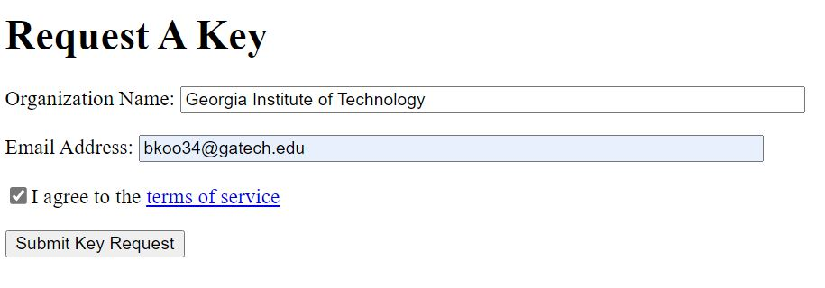
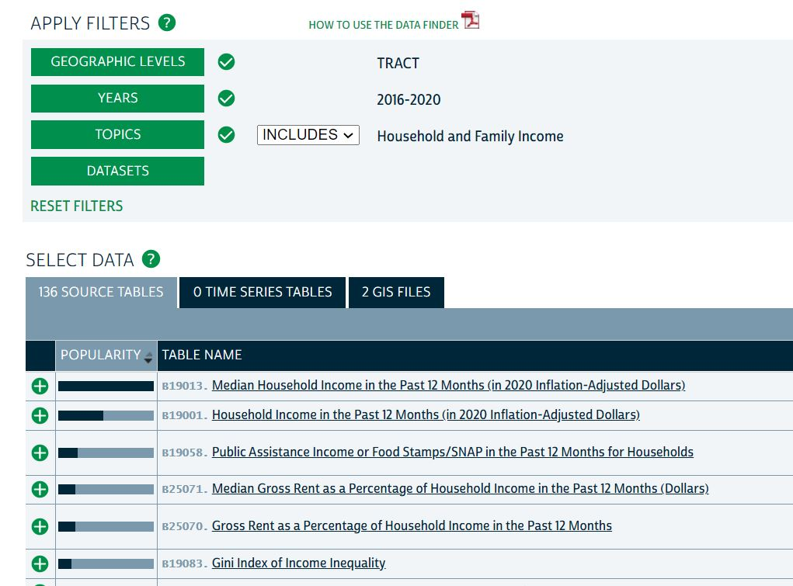
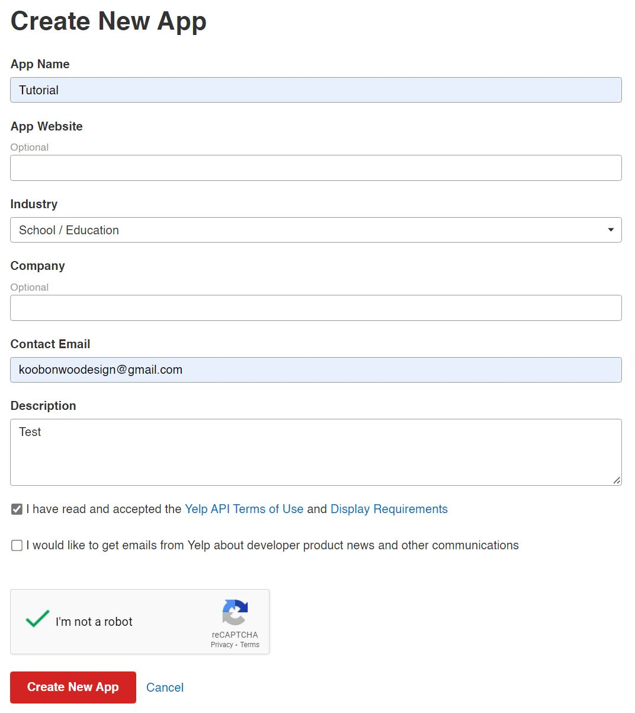

class: middle, inverse

# Accessing data through API

.font100[
Subhro Guhathakurta & Uijeong Hwang

9/5/2023
]

```{r xaringan-themer, include=FALSE, warning=FALSE}
library(xaringanthemer)
style_mono_accent(
  base_color = "#1c5253",
  header_font_google = google_font("Open Sans"),
  text_font_google   = google_font("Source Sans Pro", "400", "400i"),
  code_font_google   = google_font("Fira")
)

nice_table <- function(df, height="150px"){
  return(
    df %>% kable() %>% 
      kable_styling(latex_options="scale_down", font_size=12) %>% 
      scroll_box(width = "100%", height = height)
    )
}
```

```{r, include=F}
library(xaringanthemer)
library(sf)
library(tidyverse)
library(leaflet)
library(tmap)
library(kableExtra)
```

---
## Content
* Yelp API Key
* Census API Key
* NHGIS
* Defining Function
* Using Environment Variable
* Yelp Business Search and Pagination
* Using Tracts to Break Down the Break

---
## Census API Key

* We will be using Census data frequently throughout this course.
* Census data will accessed within R through Census API.
* You need a key, which can be acquired from **[here](https://api.census.gov/data/key_signup.html).**



---
## Census & NHGIS
* We need to specify which variable we'd like to download. 
  * For example, median household income = Table ID B19013.
* These codes are can be found in all websites that provide Census data.
* I recommend [National Historical GIS (NHGIS)](https://www.nhgis.org/).
* There can be multiple variable IDs within one table ID.
  * E.g., there are 10 variables for Table ID B19013, broken down by race (e.g., B19013A_001)
  * This variable codes can be found in **`tidycensus::load_variables()`**.

---
E.g.,for median household income,

```{r echo=F}

```

---
## Defining function
* We have been using various functions, mean(), filter(), st_coordinates, etc.
* We can write our own functions to simpler and more maintainable code.

.red[my_function] <- .blue[function](arg1, arg2, ... )
{  
  .green[some operation using arg1, arg2, and so on]  
}

```{r}
# Converting F to C
f_to_c <- function(x)
{
  z <- (x - 32)*(5/9)
  return(z)
}

f_to_c(100)
```

---
## Yelp API Key

.pull-left[
.footnotesize[
* Just like Census, we need an API key to make API request to Yelp server. Click **[here](https://www.yelp.com/developers/documentation/v3/authentication)**.
  1. Sign up.
  2. Then go [here](https://www.yelp.com/developers/v3/manage_app) to Create New App.
  3. Fill out form.
  4. You will have an email from Yelp. Once you confirm, the webpage will refresh and your key will be there.
  5. You might need to fill out the form again (but won't have to do the email verification).
]]

.pull-right[
```{r, out.width = "400px", echo=F}

```
]

---
## Using Environment Variables
* API services are often **not** free.
* If someone uses your API key, you will be charged.
* **PROTECT IT.**


* Everything on Rpubs is public.
* You shouldn't type your API key in your code.
* Instead use environment variable.

```{r}
a <- Sys.getenv("census_api")
```

---
## Yelp Business Search 

* "[Business search] endpoint returns up to 1000 businesses based on the provided search criteria." 
  * Search is done with (1) a lng/lat coordinate and (2) search radius.
* We can't get info on all restaurants in Atlanta in one API request if there are more than 1000
* We need to make sure **one search criteria returns < 1000 hits**.
* Atlanta should be broken down to **smaller bits**.
* We will use **Census Tracts as the bits**
  * We will download Yelp data for each Census Tract and combine them.

---
## Pagination

* Even if we have < 1000 hits, we still can get up to 50 business information per one request.
* E.g., there is 254 businesses in a given Census Tract. We need to make **ceiling(254/50)** requests to collect 254 business information.
* In the first request, we set **offset=0**. After collecting the first 50 business information, we set **offset=50** in the next request, and so on until we collect all of them.

.center[
```{r, out.width="400px", echo=F}
knitr::include_graphics("pagination.png")
```
]

---
## Using Tracts to Break Down the Search

1. Generate a **bounding box** of a given Census Tract.
2. Find the **centroid** of the bounding box.
3. Find the **radius** of search area from the centroid such that *the circle defined by the centroid and radius entirely contains the polygon*.
4. Centroid = lat/lng for Yelp search. Radius = distance.
5. Send API request to Yelp server to get a response.

.center[
```{r, out.width = "300px", echo=F}
knitr::include_graphics("radius.png")
```
]
---
## Using Tracts to Break Down the Search

* We can repeat this process for all Census Tracts,
* which will generate n separate responses, where n = number of Census Tracts.
* These responses will be combined together.
