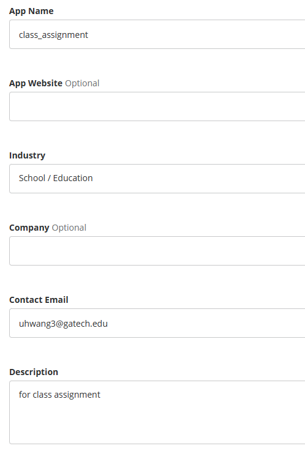
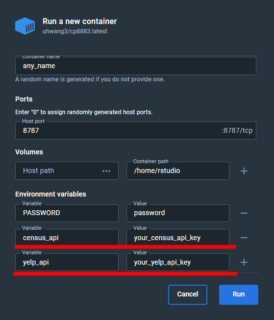
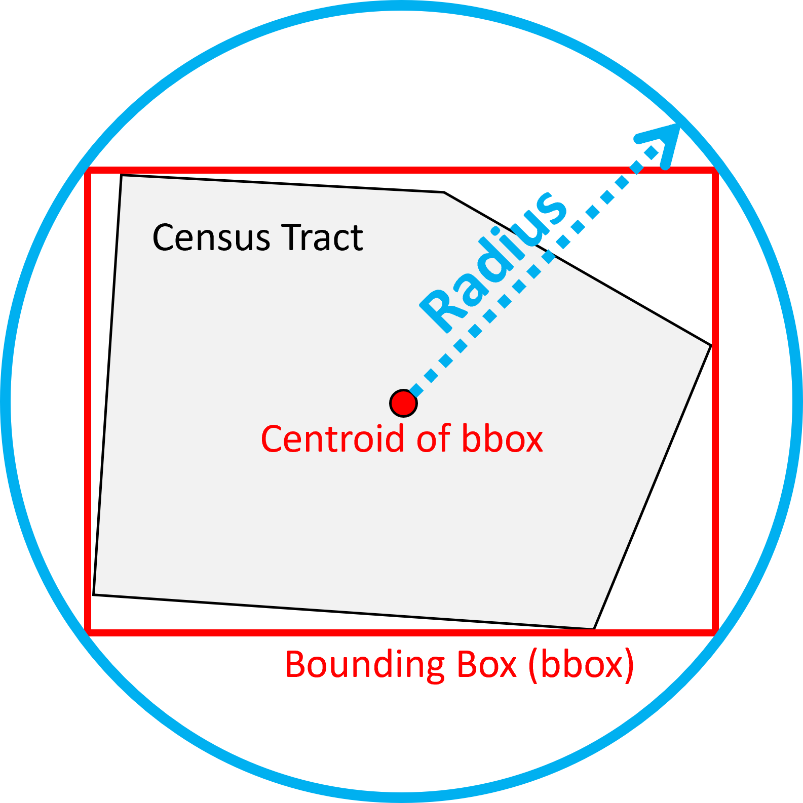
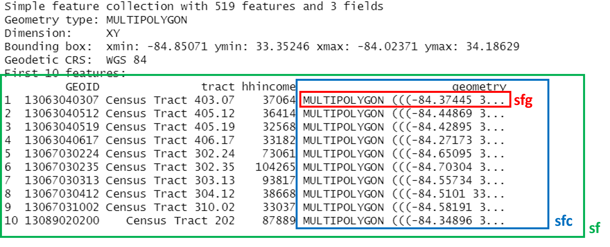

class: middle, inverse

# Accessing data through API

.font100[
Subhro Guhathakurta & Uijeong Hwang

9/5/2023
]

```{r xaringan-themer, include=FALSE, warning=FALSE}
library(xaringanthemer)
style_mono_accent(
  base_color = "#1c5253",
  header_font_google = google_font("Open Sans"),
  text_font_google   = google_font("Source Sans Pro", "400", "400i"),
  code_font_google   = google_font("Fira")
)

nice_table <- function(df, height="150px"){
  return(
    df %>% kable() %>% 
      kable_styling(latex_options="scale_down", font_size=12) %>% 
      scroll_box(width = "100%", height = height)
    )
}
```

```{r, include=F}
library(xaringanthemer)
library(sf)
library(tidyverse)
library(leaflet)
library(tmap)
library(kableExtra)
```

---
## Content
* Yelp API Key
* Census API Key
* Using Environment Variable
* Tidycensus
* Yelp Business Search and Pagination
* sfg, sfc, and sf


---
## Yelp API Key

.pull-left[
.footnotesize[
* Just like Census, we need an API key to make API request to Yelp server. Click **[here](https://fusion.yelp.com/)**.
  1. Sign up.
  2. Then go [here](https://www.yelp.com/developers/v3/manage_app) to Create New App.
  3. Fill out form.
  4. You will get an email from Yelp. Once you confirm, the webpage will refresh and your key will be there.
  5. (You might need to fill out the form again, but will not have to do the email verification).
]]

.pull-right[
```{r, out.width = "400px", echo=F}

```
]

---
## Census API Key

* We will be using Census data frequently throughout this course.
* Census data will accessed within R through Census API.
* You need a key, which can be acquired from **[here](https://api.census.gov/data/key_signup.html).**
* Information required: organization name & email address

---
## System Environment Variables
* API services are often **not** free.
* If someone uses your API key, you will be charged.
* **PROTECT IT.**
* Everything on Rpubs is public.
* You should not type your API key in your code.
* Instead, use environment variable.

```{r eval=F}
Sys.getenv("census_api")
```

---
## How to set up system environment variable: using Docker
.pull-left[
* Create a new container with api keys as environment variables.
]
.pull-right[

]

---
## How to set up system environment variable: in Windows
.small[
* Press Windows key and search 'edit the system environment variables'.  
  (Or, go to Control panel - System - Advanced system settings - 'Advanced' tab)
* Click 'Environment Variables' and add the environment variables.
]


---
## How to set up system environment variable: in MacOS
.small[
1. Open the terminal.
2. Run `echo $SHELL` and check the path:
  - if the path is `/bin/zsh`, go to 3.1.
  - if the path is `/bin/bash`, go to 3.2.
3. Run one of the following commands to open the file in text editor:
  1. `nano ~/.bash_profile`
  2. `nano ~/.zshrc`
4. Add environment variables by adding the following line(s):  
  `export [variable_name]=[variable_value]`
5. Save and close the file by pressing `Ctrl + O` and then `Ctrl + x`.
6. Run RStudio and see if the system environment variable is working:  
  `Sys.getenv('your_sys_env_var_name')`
]

---
## Tidycensus
* `tidycensus` allows r users to download Census data (via the Census API) in **data frame** or **sf** formats.
* To retrieve Census data using an R script, we need to know the code of the variable we want to access.
  - For example, the code for median household income is B19013.
* One quick way to search for the variable code is by using [National Historical GIS (NHGIS)](https://www.nhgis.org/).
* Another method is to use a function within `tidycensus`.
  - **`tidycensus::load_variables()`** provides a list of variables and their descriptions.

---
## NHGIS data finder
```{r echo=F}
knitr::include_graphics("img/nhgis.JPG")
```

---
## Yelp Business Search 

* "[Business search] endpoint returns **up to 1000 businesses** based on the provided search criteria." 
  * Search input: (1) a lng/lat coordinate and (2) search radius.
* We need to make sure **each search returns < 1000 results**.
* Atlanta should be broken down to **smaller bits**.
* We will download Yelp data for each **Census Tract** and merge them.

---
## Pagination

* Even if we have less than 1000 results, we cannot get all their information in one API request.
* we can only get **up to 50 business information** per request.
  - If there are 130 results, for example, we need to request 3 times: 1-50, 51-100, and 101-130.
* In the first request, we set **offset=0**. After collecting the first 50 business information, we set **offset=50** in the next request, and so on until we collect all of them.

.center[
```{r, out.width="400px", echo=F}
knitr::include_graphics("img/pagination.png")
```
]

---
## Using Tracts to break down the search

.small[
1. Generate a **bounding box** of a given Census Tract.
2. Find the **centroid** of the bounding box.
3. Find the **radius** of search area from the centroid such that *the circle defined by the centroid and radius entirely contains the polygon*.
4. Centroid = lat/lng for Yelp search. Radius = distance.
5. Send API request to Yelp server to get a response.
6. We can repeat this process for all Census Tracts
]

.center[
```{r, out.width = "300px", echo=F}

```
]

---
## sfg, sfc, and sf

### How simple features in R are organized:
* **Simple feature geometry.**
  * `my_point <- st_point(c(-84.388, 33.749))`.
  * **my_point** is a point on an arbitrary plane.
  * It cannot be mapped on Earth.
* **Simple feature geometry list-column.**
  * `my_sfc <- st_sfc(my_point, crs = 4326)`.
  * It adds **crs** information to sfg object.
  * With CRS defined, now R knows where that point is on Earth.
  * **CRS** must match the coordinates used to create sfg object.
  * The geometry column you see in sf objects = sfc

---
* **Simple feature** 
  * `my_sf <- st_sf(my_sfc)`
  * This is the combination of a **data frame** and **sfc** object.
  * e.g., dplyr verbs don't work for sfc, but they work for sf.

<br>


```{r, echo=F, out.width="100%"}

```

---
To create (POINT) sf object from a pair of lng/lat coordinates, you need to do it in **sfg &rarr; sfc &rarr; sf**, in this order.
.footnotesize[
1. Create an .red[**sfg**] using coordinates. **my_sfg <- st_point(c(-84.388, 33.749))**.
2. Convert the .red[**sfg**] object into .blue[**sfc**] object with CRS info. **my_sfc <- my_sfg %>% st_sfc(crs = 4326)**.
3. Convert the .blue[**sfc**] object into .green[**sf**] object using **my_sf <- st_sf(my_sfc)**.
]
<br>
```{r, echo=F, out.width="100%"}

```
