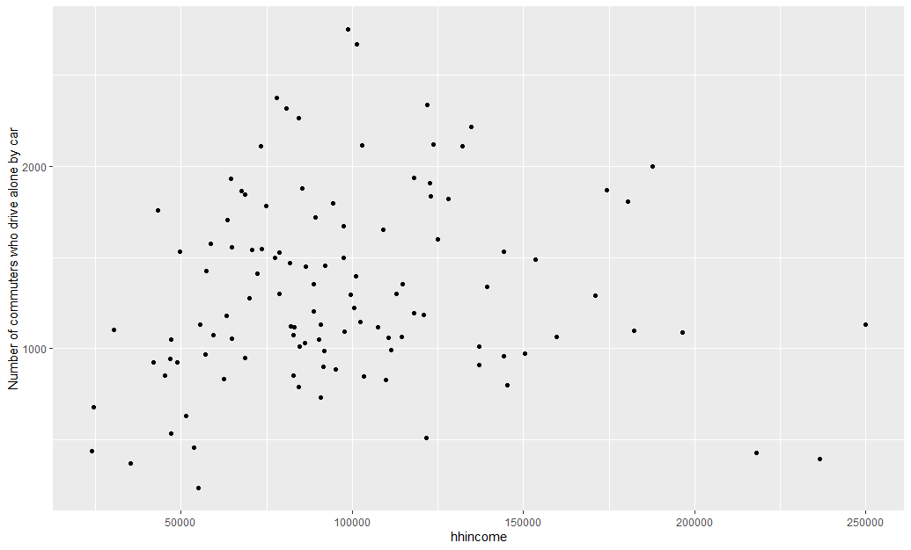

```{r setup, include = FALSE}
library(knitr)
library(tidyverse)
library(NHSRtheme)
library(skimr)
library(tmap)
tmap_mode("view")
# set default options
opts_chunk$set(echo = FALSE,
               fig.width = 10.252,
               fig.height = 10,
               dpi = 300)

yelp_census4 <- read_rds("yelp_census4.rds")
census_yelp <- read_rds("census_yelp.rds")
# uncomment the following lines if you want to use the NHS-R theme colours by default
# scale_fill_continuous <- partial(scale_fill_nhs, discrete = FALSE)
# scale_fill_discrete <- partial(scale_fill_nhs, discrete = TRUE)
# scale_colour_continuous <- partial(scale_colour_nhs, discrete = FALSE)
# scale_colour_discrete <- partial(scale_colour_nhs, discrete = TRUE)
```

class: title-slide, left, bottom

# `r rmarkdown::metadata$title`
----
## **`r rmarkdown::metadata$subtitle`**
### `r rmarkdown::metadata$author`
### `r rmarkdown::metadata$date`

---
# Why do we conduct <font bf>Exploratory Data Analysis</font>?
--

### 1. To examine possible inaccuracies and inconsistencies
    a. Outliers
    b. Data falling outside the known parameters (bad data)
    c. Incomplete data (NA and illegitimate 0 values)
--
### 2. Explore trends and variations in the data
    a. Look for central tendencies, frequent values
    b. Skewness and non-linearities
--
### 3. Explore relationships
    a. How are the variables associated with each other?
    b. What are some interesting patterns?
    c. What interesting questions can be addressed with the data?
---
class: inverse, middle, center

## If you observe relationships between two or more variables, be careful NOT to assume cause and effect!
## "Correlation does not imply Causation!"


---
# Getting summary statistics: The "skimr" package
```{r echo=TRUE, message=FALSE, warning=FALSE, paged.print=TRUE}
library(skimr)
skim(yelp_census4)
```


---
#Checking for data issues using "skimr" package

{width=500px height=500px}

---
class: inverse, middle, center
### skim(yelp_census) # Another part of the output..
### 1. Variable Type
### 2. Missing values
### 3. Histograms


										
---
# Plotting data is a useful way to look for trends and associations
```{r out.width = '80%'}

```

---
class: inverse, middle, center
#Any problem with the previous plot?
### Can the number of households in an area confound your result?


---
# Redoing the plot with Proportion of Commuters who Drive to Work Alone

```{r out.width = '80%'}

```

---
#Always a Good Idea to Check Spatially as Well

```{r out.width = '50%'}

```

---
# Measures of Association
--

## Always use the right measure for the type of variables you are examining
### Different measures for Nominal, Ordinal, and Ratio data
--

Ideally you want measures that show:
1. Magnitude of the relationship
2. No relationship indicated by 0
3. Perfect relationships indicated by +1 or - 1
4. The sign indicated the direction of the relationship
---
# Measures of Association Commonly Used

### 1. For Nominal to Nominal Associations:
  - Chi-Square test of independence is commonly used (sensitive to size of data) 
  - Also, Phi coefficient (for 2 x 2 tables) and Cramer's V (for larger tables)
  
--

### 2. For Nominal to Ordinal or Nominal to Nominal Relationships
  - Chi-Square, Goodman & Kruskal's Lambda, Cramer's V
```{r echo=TRUE}
#install.packages("GoodmanKruskal", "DescTools")
library("GoodmanKruskal", "DescTools")
load(file="cars93.rda")
GKtau(cars93$type, cars93$drive_train)
```
  
--

### 3. For ratio variables
  - Correlation Coefficient and covariance (rarely used)

---
# Simple Bivariate Regression

##Regression analysis allows us to measure the relationship between a dependent variable and one or more independent variables

.pull-left[
### We can think of this relationship as the line that best fits a series of data points on an X-Y axis

### The best fitting line is the line that minimizes the "error" between predicted y and actual y
]
.pull-right[
```{r out.width = '100%'}
knitr::include_graphics("img/bivariate_regression.png")
```
]

---
# Regression Explaining Work from Home and Income (Which should be dependent?)
```{r, out.width ="200px", out.height="200px", echo=TRUE}
regress_wfh <- lm(yelp_census4$prop_wfh~yelp_census4$hhincome)
summary(regress_wfh)
```
---
# Plot the regression line
```


```{r, out.width ="400px", out.height="400px", echo=TRUE}
plot (yelp_census4$hhincome, yelp_census4$prop_wfh, main = "Regression for Work from Home and income", xlab="Household Income", ylab="Percent working from home")

abline(lm(prop_wfh~hhincome, data=yelp_census4), col="red")
```
---
# Next day (Thursday) We will Explore the hypothesis: 
## Are yoga studios  associated with gentrified neighborhoods?

```{r, out.width ="800px", out.height="400px", echo=TRUE}
tm_shape(census_yelp) + tm_polygons("hhincome") +
  tm_shape(yelp_census4) + tm_dots()
```
