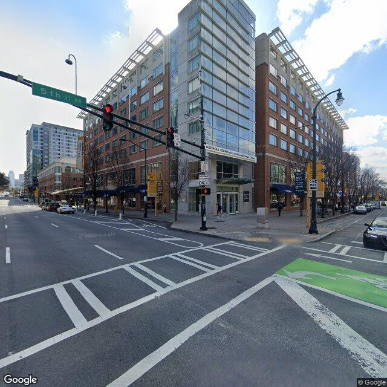
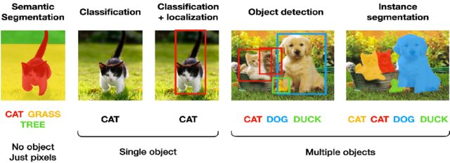

class: middle, inverse

# Urban Images

.font100[
Subhro Guhathakurta & Uijeong Hwang

10/17/2023
]

```{r xaringan-themer, include=FALSE, warning=FALSE}
library(xaringanthemer)
style_mono_accent(
  base_color = "#1c5253",
  header_font_google = google_font("Open Sans"),
  text_font_google   = google_font("Source Sans Pro", "400", "400i"),
  code_font_google   = google_font("Fira")
)

nice_table <- function(df, height="150px"){
  return(
    df %>% kable() %>% 
      kable_styling(latex_options="scale_down", font_size=12) %>% 
      scroll_box(width = "100%", height = height)
    )
}
```

```{r, include=F}
library(xaringanthemer)
library(sf)
library(tidyverse)
library(leaflet)
library(tmap)
library(kableExtra)
library(here)
```

---

```{r, echo=FALSE, message=FALSE, include=FALSE, warning=FALSE}
pspnet2 <- st_read(here("Lab","module_4","pspnet_4git.geojson")) %>% 
  mutate(b2s = (p.building + p.house)/(p.sidewalk + p.road + p.car),
         green = p.tree + p.plant + p.grass,
         s2s = p.sidewalk/(p.sidewalk + p.road + p.car))

draw_map <- function(var, FUN = colorNumeric){
  pal <- FUN(palette = "Reds", domain = pspnet2[[var]])

  leaflet() %>% 
    addProviderTiles(providers$CartoDB.DarkMatterNoLabels) %>% 
    addPolylines(data = pspnet2, color = ~pal(pspnet2[[var]]), weight = 2) %>% 
    addLegend(position="bottomright", pal = pal, values = pspnet2[[var]], title = paste0("% ", substr(var,3,nchar(var))))
}
```

```{r, echo=FALSE, message=FALSE, warning=FALSE, width="100%"}
draw_map("p.building",colorQuantile)
```

[More here](https://rpubs.com/bonwoodesign/streetscapes).

---

## Module 4 in a nutshell

1. Download street network data (OSM) and clean it.
2. Generate points along the edges. These will be where GSV images will be downloaded.
3. Calculate the heading of the cameras for each point. 
4. Create a function that takes a point as input and download GSV images.
5. Apply computer vision to the images
6. Merge the results back to the points from Step 2.

* Download [this file](https://github.com/ujhwang/UrbanAnalytics2023/raw/main/Lab/module_4/downloaded_image/sample_image.zip), unzip it.
* Create in the root folder of your Google Drive a folder named demo_image.
* Drag-drop the unzipped file (four images) in the folder.

---
## Why Street View Images

* Measuring street environment is important for numerous reasons - public health, public safety, environmental sustainability, economic vitality, tourism, etc.
* Residential density, street connectivity, land use mix, Sprawl Walk Score, etc. 
* In urban environment, street-by-street variation can be huge. E.g., even in areas with the same Walk Score, the quality of the streetscapes can be very different (e.g., [this paper](https://www.mdpi.com/2071-1050/9/7/1233)).
* Street View Images allow us to examine (e.g., audit) the streetscapes without traveling. 

---

## Street View Images 

* Images taken at roughly 10~20 meter intervals from cameras that are (often but not always) mounted on car roof.
* 360-degree image in all directions.
* Have coverage both in US and internationally and can go back in time. 

```{r, out.width="50%",echo=FALSE}
knitr::include_graphics("street_view_car.png")
```
  
.footnotesize[Source: Google]

---
## Street View Images 

* Around 2010, planning studies started using Google Street View (GSV) images.
* To audit street environments using GSV images.
* In early studies, still human auditors were looking at GSV and did manual audits.
* Recent studies are increasingly using computer vision instead of manual audits.

---
## Street View Images 

* Web version of GSV is free but **.red[their API is NOT FREE!]** (7.00 USD per 1000 images)
* Maximum Queries per Minute (QPM): 30,000. Requests up to 25,000 per day require an API key.
* Do not distribute images nor use it for commercial purposes.
* You should **.red[NEVER EXPOSE]** your API key. You can get charged for a lot of money.
* Get your key [here](https://github.com/ujhwang/UrbanAnalytics2023/blob/main/Lab/module_4/how_to_get_your_key.pptx)

---

.pull-left[
.center[
**GSV from web**
]

]

.pull-right[
.center[
**GSV from API**
]

]

---
## Example Request

.center[
https://maps.googleapis.com/maps/api/streetview?.red[size=600x300].blue[&location=46.414382,10.013988]<br>.orange[&heading=151.78].pink[&pitch=-0.76].green[&key=YOUR_API_KEY]
]

* **Size**: Cappted at 640x 640 pixels.
* **Location**: Coordinates in 4326.
* **Heading**: Heading of the camera <br>.small[.gray[(0=North, 90=East, 180=South, 270=West, 360=North)]]
* **Pitch** (default 0): Specified up or down angle of the camera.
* **Source**:  limits Street View searches to selected sources. Either default or outdoor.
* **fov**: (default 90): determines the horizontal field of view of the image.
* **key**: Your API key.

---

## Try it

This URL (with your key added) will give you an image at Tech Square.

https://maps.googleapis.com/maps/api/streetview?size=640x640>&location=33.7768249,-84.388767&heading=224.96&<br>fov=90&pitch=0&key=YOUR_API_KEY

---
## Computer Vision

* Image classification: [3D interactive visualization of CNN](https://adamharley.com/nn_vis/cnn/3d.html) (source: adamharley.com)
* [Schematic of convolution](https://cs231n.github.io/convolutional-networks/) (source: Stanford CS231n)
* Common computer vision tasks.

```{r, echo=FALSE, out.width="80%"}

```
.footnotesize[Source: http://cs231n.stanford.edu/slides/2017/cs231n_2017_lecture11.pdf]


---
## Google Colab

* Google Colab is a hosted Jupyter notebook service.
* It requires minimum setup to use. Provide GPU in case you want it.
* The free tier has 12 hour limit; after 12 hours of computation, your session will expire.
* [[Link to Colab 1]](https://colab.research.google.com/drive/1G9m85QNlMqAHNuw854qhZQTFAqetrnYG?usp=sharing)
* [[Link to Colab 2]](https://colab.research.google.com/drive/16Da-YywiLVS5IY3NXlYWxQbH7TaKsoeW?usp=sharing)

