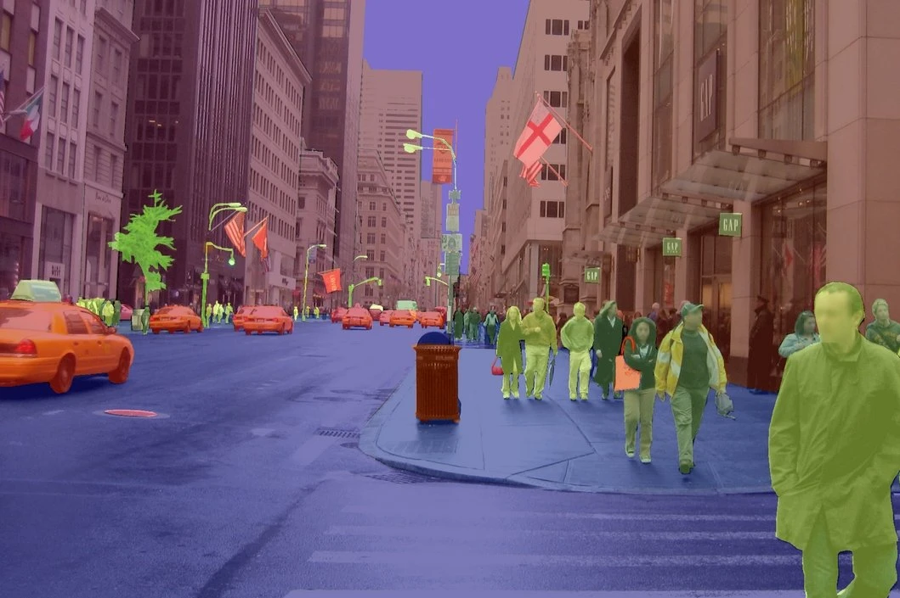
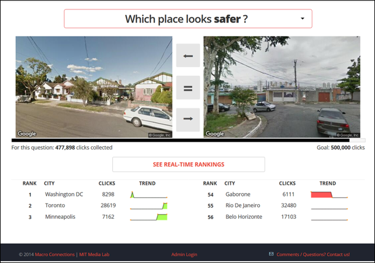

class: middle, inverse

# Urban Images and Computer Vision

.font100[
Subhro Guhathakurta & Uijeong Hwang

10/19/2023
]

```{r xaringan-themer, include=FALSE, warning=FALSE}
library(xaringanthemer)
style_mono_accent(
  base_color = "#1c5253",
  header_font_google = google_font("Open Sans"),
  text_font_google   = google_font("Source Sans Pro", "400", "400i"),
  code_font_google   = google_font("Fira")
)

nice_table <- function(df, height="150px"){
  return(
    df %>% kable() %>% 
      kable_styling(latex_options="scale_down", font_size=12) %>% 
      scroll_box(width = "100%", height = height)
    )
}
```

```{r, include=F}
library(xaringanthemer)
library(sf)
library(tidyverse)
library(leaflet)
library(tmap)
library(kableExtra)
library(here)
```

---
## Module 4 in a nutshell

1. Get Google API key.
2. Download street network data (OSM) and clean it.
3. Generate points along the edges. These will be where GSV images will be downloaded.
4. Calculate the heading of the cameras for each point. 
5. Create a function that takes a point as input and download GSV images.
6. Apply computer vision to the images.
7. Merge the results back to the points from Step 2.
* Your Google API key should be ready by next Tuesday.
* We will cover Steps 2-5 next Tuesday and Steps 6-7 next Thursday.
* We will use Google Colab for the computer vision part (Steps 6-7).

---
## Google Colab(oratory)

* Google Colab is a cloud-based Jupyter notebook service hosted by Google.
* The free tier has 12 hour limit; after 12 hours of computation, your session will expire.

```{r, echo=FALSE, out.width="60%"}

```
  
---
class: inverse, middle, center

# Street View Images

---
## Why Street View Images

* Measuring built environment is important for numerous reasons - public health, public safety, environmental sustainability, economic vitality, tourism, etc.
* Built environment literature commonly differentiate between the urban form and streetscape.
  * ***Urban form***: macroscale-built environment which characterizes street connectivity, density, and diversity of land use.
  * ***Streetscape***: pertains to physical layout and design of the built environment, such as **sidewalk width, enclosure, tree canopy, landscaping, and street furniture**.
* Street View Images allow us to examine the streetscapes without traveling. 

---
## Street View Images API

* Google Street View
* Bing Maps Streetside View
* Mapillary: platform for sharing crowdsourced geotagged street view images; acquired by Meta in 2020.
> Compare [Google](https://maps.app.goo.gl/Vc9kw9WNnWC6QywN9), [Bing](https://www.bing.com/maps?cp=33.776839%7E-84.389371&lvl=15.4&pi=6.8&style=x&mo=om.1&dir=85.1), and [Mapillary](https://www.mapillary.com/app/?lat=33.776851232857&lng=-84.389502582857&z=17&pKey=908091313101146&focus=photo&x=0.494875692639787&y=0.6273840659246637&zoom=0) street view images.

---
## Google Street View Images 

* Images taken at roughly 10 meter intervals from cameras that are (often but not always) mounted on car roof.
* 360-degree image in all directions.
* Have coverage both in US and internationally and can go back in time. 

```{r, out.width="50%",echo=FALSE}

```
  
.footnotesize[Source: Google]

---
## Google Street View Images

* Around 2010, planning studies started using Google Street View (GSV) images.
* To audit street environments using GSV images.
* In early studies, still human auditors were looking at GSV and did manual audits.
* Recent studies are increasingly using computer vision instead of manual audits.

---
## Google Street View Images

* Web version of GSV is free but **.red[their API is NOT FREE!]** (7.00 USD per 1000 images)
* You get $200 credit every month, so you can get about 28,000 street view images per month.
* Maximum Queries per Minute (QPM): 30,000. Requests up to 25,000 per day require an API key.
* Do not distribute images nor use it for commercial purposes.
* You should **.red[NEVER EXPOSE]** your API key. You can get charged for a lot of money.
* Follow the instruction [here](https://raw.githubusercontent.com/ujhwang/UrbanAnalytics2023/main/Lab/module_4/how_to_get_your_key.pptx) to get your Google API key.
* Once you complete getting the key, I highly recommend setting up a budget alert (Billing --> Budgets & alerts --> create budget).

---

.pull-left[
.center[
**GSV from web**
]

]

.pull-right[
.center[
**GSV from API**
]

]

---
## Example Request

.center[
https://maps.googleapis.com/maps/api/streetview?.red[size=600x300].blue[&location=46.414382,10.013988]<br>.orange[&heading=151.78].pink[&pitch=-0.76].green[&key=YOUR_API_KEY]
]

* **Size**: Capped at 640x 640 pixels.
* **Location**: latitude and longitude.
* **Heading**: Heading of the camera <br>.small[.gray[(0=North, 90=East, 180=South, 270=West, 360=North)]]
* **Pitch** (default 0): Specified up or down angle of the camera.
* **fov**: (default 90): determines the field of view of the image.
* **key**: Your API key.

---

## Try it

This URL (with your key added) will give you an image at Tech Square.

https://maps.googleapis.com/maps/api/streetview?size=640x640>&location=33.7768249,-84.388767&heading=224.96&<br>fov=90&pitch=0&key=YOUR_API_KEY

---
class: inverse, middle, center

# Computer Vision

---
## Computer vision
* Computer vision is the field of AI (particularly, deep learning) that enables computers to interpret and understand visual information.
* Deep learning is part of a broader family of AI methods based on **artificial neural networks** with representation learning.
* Example architecture: Convolutional Neural Network (CNN)

  
.footnotesize[
(source: https://medium.com/@eric.perbos/fast-ai-deep-learning-for-coders-part-1-2017-3db56c1a4cf3)
]

---
## Computer vision
* Deep learning algorithms are stacked in a hierarchy of increasing complexity and abstraction
  


.footnotesize[
(source: https://medium.com/analytics-vidhya/convolutional-neural-network-an-informal-intro-part-1-db9fca86a750)
]

---
## Classification
* Image classification: [3D interactive visualization of CNN](https://adamharley.com/nn_vis/cnn/3d.html) (source: adamharley.com) 


---
## Segmentation
* Segmentation models detect 'Things' and 'Stuff' from an image.
* Things: countable objects such as person, bike, and car.
* Stuff: uncountable region of identical texture, such as sky and road.

```{r, echo=FALSE, out.width="70%"}

```
.footnotesize[
(source: https://viso.ai/deep-learning/image-segmentation-using-deep-learning/)
]

---
## Segmentation
* Semantic Segmentation: Classifies each pixel of an image into a class.
* Instance Segmentation: Detects objects and distinguishes instances.
* Panoptic Segmentation: Combines the two methods above.

```{r, echo=FALSE, out.width="73%"}
knitr::include_graphics("img/segmentation_types.png")
```
.footnotesize[
(source: https://arxiv.org/pdf/2006.12567.pdf)
]


---
class: inverse, middle, center

# Levaraging Street View Images and Computer Vision in Urban Studies

---
## Perception of streetscape and bike lanes

* Research question: **“Do bike lanes in low-income neighborhoods—which are often perceived as less safe and unappealing—yield the same results as those in safer, more affluent neighborhoods?”**

* In other words, **"Does the impact of bike lanes on encouraging biking differ by the perception of streetscapes?"**

```{r, echo=FALSE, out.width="100%"}
knitr::include_graphics("img/good_bad_streetscape.png")
```

---
## Operational approach

1. **Train** a Deep Learning model that predicts a “perception” (value) from a given “streetscape” (image).

2. **Infer** perception scores of street images for an entire city using the trained model.

3. **Model** the associations between perception of streetscape, bike lanes, and biking behaviors.

---
## Training data: Place Pulse 2.0
* Online crowdsourced dataset of perceptual attributes – **safe**, lively, beautiful, wealthy, depressing, and boring – of street view images collected by researchers at the MIT Media Lab.



---
## Training: transfer learning
* Transfer learning leverages the knowledge of a pre-trained model, instead of training from scratch


---
## Training: transfer learning
* Transfer learning leverages the knowledge of a pre-trained model, instead of training from scratch


---
## Training result
```{r, echo=FALSE, out.width="80%"}

```
  
---
## Inference data: Mapillary
* There are 7.4 million Mapillary street view image in Berlin, Germany.


---
## Inference result


