```{r setup, include = FALSE}
library(knitr)
library(tidyverse)
library(skimr)
library(tmap)
tmap_mode("view")
# set default options
opts_chunk$set(echo = FALSE,
               fig.width = 10.252,
               fig.height = 10,
               dpi = 300)

# yelp_census4 <- read_rds("C:/Users/sguhathakurta3/OneDrive - Georgia Institute of Technology/courses/Intro to Urban Analytics/Course_Slides/Lecture-2/yelp_census4.rds")
# census_yelp <- read_rds("C:/Users/sguhathakurta3/OneDrive - Georgia Institute of Technology/courses/Intro to Urban Analytics/Course_Slides/Lecture-2/data/census_yelp.rds")
# uncomment the following lines if you want to use the NHS-R theme colours by default
# scale_fill_continuous <- partial(scale_fill_nhs, discrete = FALSE)
# scale_fill_discrete <- partial(scale_fill_nhs, discrete = TRUE)
# scale_colour_continuous <- partial(scale_colour_nhs, discrete = FALSE)
# scale_colour_discrete <- partial(scale_colour_nhs, discrete = TRUE)
```

class: title-slide, left, bottom

# `r rmarkdown::metadata$title`
----
## **`r rmarkdown::metadata$subtitle`**
### `r rmarkdown::metadata$author`
### `r rmarkdown::metadata$date`

---
# The Data Story

```{r out.width = '70%'}
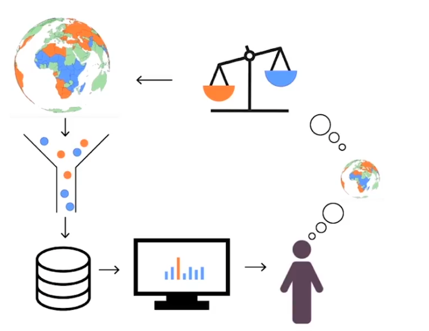
```

---
# My approach to storytelling from data and models
.pull-left[ 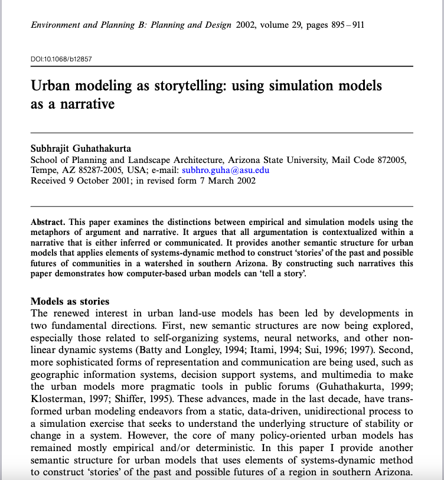]

--

.pull-right[
```{r out.width = '100%'}
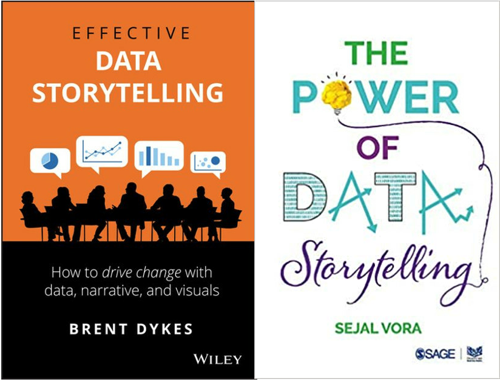
```
]
---
# Why Storytelling is an Essential Art & Skill for Data Analysts?

### 1. Stories are powerful means of communication!
    a. Storytelling is an integral part of humanity
    b. Storytelling is more memorable and persuasive than just facts
    c. Stories can explain, engage, and enlighten
--
    
### 2. Stories affect us neurologically by changing our brain chemistry
    a. Research into what happens to the molecules in the brain when we hear a story (Zak 2012)
    b. In 2000, research by psychologists Melanie Green and Timothy Brock showed that the more individuals were transported or absorbed in a story, the more their beliefs aligned with those expressed in the story—regardless of their prior beliefs. 
  
---
class: inverse, center, middle
# Effective storytelling can drive change


--

## Stories define the issues and provide a means to make subtle but powerful arguments


---
class: inverse, middle, center

## "We forget too easily that science is a cultural form of argument, not a valueless, passionless use of magical techniques." John Forester (1993)
--


## "The hearers of the story believed that it was true because it was meaningful, rather than it was meaningful because it was true." -- Perry and Doan (1994)


---
# Data to Story Transformation

.pull-left[
```{r out.width = '100%'}
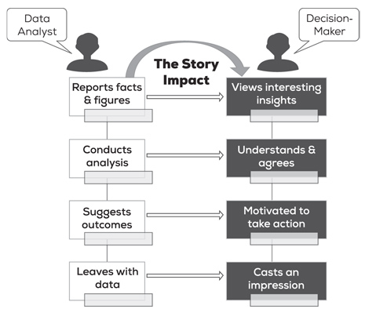
```
]
.pull-right[ From: Power of Data Storytelling by Vora (2019) ]
---
# How to Tell <font color=MeduimPurple> Effective </font> Stories

- Make an <font color=MediumPurple>emotional</font> impact

--

- Drive home a <font color=MediumPurple>message</font>
--

- Talk about <font color=MediumPurple>people</font> - not numbers

--

- Find <font color=MediumPurple>compelling</font> data to bolster your message

--

- Look at your data in different <font color=MediumPurple>interesting</font> ways

--

- Hone the message before ending

---
# In your Narrative - Appropriate <font color=MediumPurple>Visualizations</font> is the KEY
```{r out.width = '100%'}
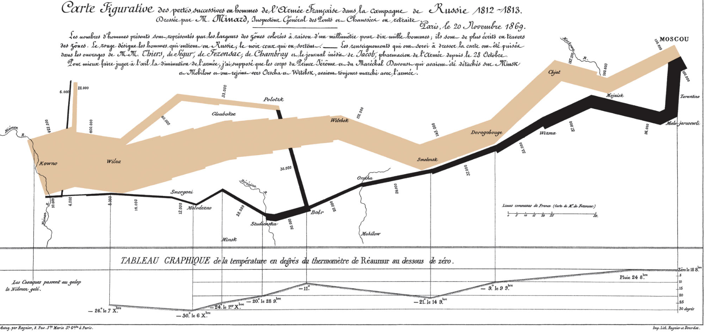
```

---
# Gestalt Principles in Effective Visualization

1. <font color=MediumPurple>Principle of proximity</font>. We perceive data elements that are near to each other as being a related group.
2. <font color=MediumPurple>Principle of similarity</font>. When items are alike in their properties, we group them together. The similarity could be based on different attributes such as size, shape, color, and so on.
3. <font color=MediumPurple>Principle of enclosure</font>. If a number of elements is surrounded by something such as a line or object, the elements will be perceived as being a group.
4. <font color=MediumPurple>Principle of connection</font>. We see elements that are connected by lines as being related to each other.
5. <font color=MediumPurple>Principle of continuity</font>. When we look at points, we will perceive them as smooth curves or continuous lines rather than sharp, broken lines.
6. <font color=MediumPurple>Principle of closure</font>. When we see gaps in lines or formations, we will organize them into complete shapes rather than seeing the parts as separate components.

From: Dykes (2020)
---
class: inverse, center, middle
```{r out.width = '100%'}
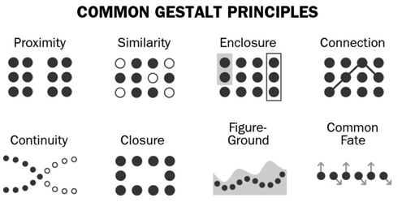
```
From: Dykes (2020) Figure 7.4
---
class: inverse, center, middle
# Effective Visualizations: Which one would you choose?


```{r out.width = '100%'}
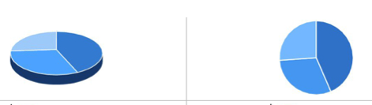
```
---
class: inverse, center, middle

```{r out.width = '100%'}
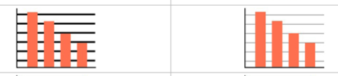
```

---
class: inverse, center, middle

```{r out.width = '100%'}
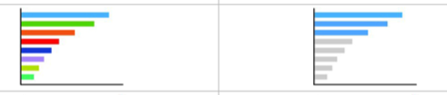
```
---
class: inverse, center, middle

```{r out.width = '100%'}
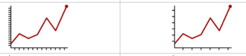
```
---
class: inverse, center, middle

```{r out.width = '100%'}
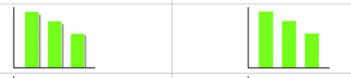
```
---
class: inverse, center, middle

```{r out.width = '100%'}
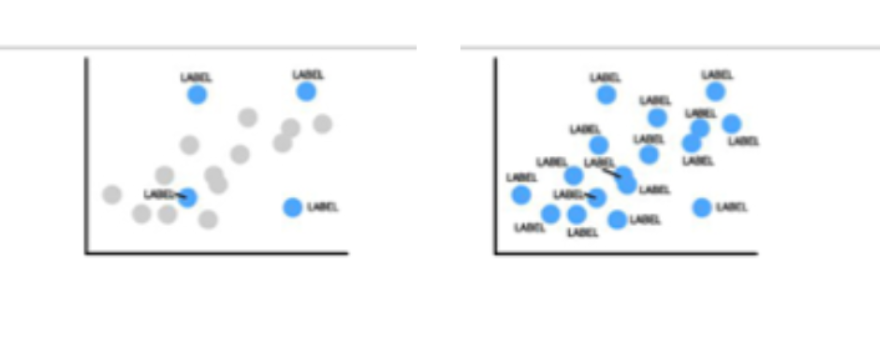
```
---
# Some Examples of Good Visualizations and Persuasive Storytelling

1. [VisualCinnamon](https://nbremer.github.io/Chord-Diagram-Storytelling/)
2. [New York Times: China Global Fishing Story](https://www.nytimes.com/interactive/2022/09/26/world/asia/china-fishing-south-america.html)
3. [Hans Rosling of Gapminder](https://youtu.be/fiK5-oAaeUs)
---
# Your Task in the next class (Assignment 4)
<font color=blue>Given the number of projects that you are trying to complete at the same time, this will be a simpler project that you could complete during the class</font>
###The Assignment
In 2020, after many frustration in obtaining the data on police killings of civillians, Brian Burghart of USC, began to collect his own data from various sources in the US. He called the database [Fatal Encounters](https://fatalencounters.org/).

The database, as you will see, is quite comprehensive - name, gender, race, location, disposition of the case, etc. Your Assignment 4 is to tell a compelling story about police killings in this country -- it does not have to be comprehensive. Any particular aspect of this dataset might be interesting to highlight and tell a unique story about. There are many stories hidden in the data -- find your own!

Deliverables:
1. An rmd file uploaded to some server (GitHub, RStudio, etc. just send the link)

  a. No more than one-page of a narrative account of your data insights and message
  
  b. At least four interesting graphics/maps to illustrate your narrative
  
2. Submission deadline next Tuesday (11/27 by midnight)
