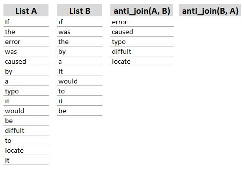

<style type="text/css">
  body{
  font-family: Arial;
  }
</style>

```{r load-packages, message=FALSE, warning=FALSE}
# Package names
packages <- c("rtweet", "ggplot2", "dplyr", "tidytext", "tidyverse", "igraph", "ggraph", "tidyr", "wordcloud2", "textdata", "sf", "tmap")

# Install packages not yet installed
installed_packages <- packages %in% rownames(installed.packages())
if (any(installed_packages == FALSE)) {
install.packages(packages[!installed_packages])
}

# Load packages
invisible(lapply(packages, library, character.only = TRUE))
```

**DISCLAIMER**: Due to the rapid production of tweets, and that they are uncensored, I can’t be sure that you may not see some images that are not suited for work / school. You may see some that are controversial as well. This is part of the urban analytics field. That said, I hope no one gets offended or upset by anything we may encounter. 

# Section 0. Get your API credential

If you don't have credentials for Twitter API, go to [this webpage](https://bonwookoo.github.io/UrbanAnalytics2022/Lab/module_4/getting_key.html) to find instructions on how to get one for yourself. 

Note that there are multiple *tiers* in Twitter API - Essential Access, Elevated Access, and Academic Research Access. Each level has their own caps in terms of the maximum number of Apps per Project, Tweet consumption per month, and others (see [this page](https://developer.twitter.com/en/docs/projects/overview) for more details). 

Twitter API provides a very well-organized document that's great for understanding the structure of the API. There are Apps and Projects in Twitter API that help you organize your work. Each Project can contain a single App if you have Essential access, and up to three Apps if you have Elevated or greater access. We will be using **Elevated Access** that allows up to 3 Apps within a Project and Tweet consumption cap of 2 million Tweets per month.


# Section 1. Let's download some Tweets

In this document, we will use two different ways of collecting Twitter data: (1) collecting live tweets and (2) collecting tweets from the timeline of some users (including past tweets). 


### Step 1-1: Getting Live Tweets
```{r}
# whatever name you assigned to your created app
appname <- "UrbanAnalytics_tutorial"

# create token named "twitter_token"
# the keys used should be replaced by your own keys obtained by creating the app  

twitter_token <- create_token(
 app = appname,
  consumer_key = Sys.getenv("twitter_key"), 
  consumer_secret = Sys.getenv("twitter_key_secret"),
  access_token = Sys.getenv("twitter_access_token"),
  access_secret = Sys.getenv("twitter_access_token_secret"))
```

We use the keyword Piedmont Park - a popular urban park in Atlanta.

```{r}
#get/search tweets with any words and hashtags   
#as an example 'piedmont park' is used which is save under the data frame name - 'park_tweets'
#'search_tweets'- is the function of 'rtweet' library
#q is the words/hashtags used to search tweets; n is the number of tweets to download at a time. Here it is 100.
park_tweets_all <- search_tweets(q = "Piedmont Park", n = 200) 
park_tweets_all <- bind_cols(park_tweets_all, 
                             users_data(park_tweets_all) %>% select(screen_name, location))
```

The search_tweets() function can go back up to about 7 days. Let's plot when the Tweets were made.

```{r}
# When were these tweet made?
park_tweets_all %>% 
  ggplot(data = .) +
  geom_histogram(mapping = aes(x = created_at), color="gray") + 
  scale_x_datetime(date_labels = " %H:%M on %b %d")
```


### Step 1-2: Tokenization & Barplot 

Tokenization is the fundamental starting point in any NLP pipeline. "Tokenization is a way of separating a piece of text into smaller units called tokens. Here, tokens can be either words, characters, or subwords. Hence, tokenization can be broadly classified into 3 types – word, character, and subword (n-gram characters) tokenization" (direct quotes from [here](https://www.analyticsvidhya.com/blog/2020/05/what-is-tokenization-nlp/)). 

As an example, consider "How are you?" Most common way of tokenization is to break at space, resulting in how-are-you. You can also do character token, e.g., h-e-l-l-o, or sub-word, e.g., smart-er. 

Then, if you code each token with a number, which allows us to represent textual data into numeric. For example, if we code h: 1, e: 2, l: 3, o:4, hello would be represented as 12334. The word heel, then can be written as 1223, and so on. You can already see the similarity between the two words, 12334 and 1223. This tokenization will be useful later when we do more sophisticated works.

To learn more, I found [this video](https://www.youtube.com/watch?v=fNxaJsNG3-s&t=1s) very intuitive.

```{r}
# unique screen_name and location of those who tweeted about the park.
# Note that screen_name is less stable over time than user_id.
# You can consider replacing screen_name with user_id.
users <- park_tweets_all %>% 
  group_by(screen_name) %>% 
  summarise(location = first(location))

user_loc <- users$location %>% 
  table() %>% 
  as_tibble()

names(user_loc) <- c("location", "n")

loc_word <- user_loc %>% 
  unnest_tokens(input = location, # name of column in the input data
                output = Location) %>% # name of the column that will be in the output
  group_by(Location) %>% 
  summarize(n = sum(n)) %>%
  arrange(desc(n))

loc_word <- loc_word %>% 
  filter(n > 1 & Location != "")

loc_word %>% 
  mutate(Location = factor(Location, levels = Location)) %>% 
  ggplot(data = .) + 
  geom_col(mapping = aes(x = Location, y = n)) +
  coord_flip()
```

### Step 1-3: Getting Tweets from User Timeline

**This section is heavily borrowed from [Median](https://medium.com/the-artificial-impostor/analyzing-tweets-with-r-92ff2ef990c6)**
```{r}
# Get time lines
obama <- rtweet::get_timeline("BarackObama", n = 3200)
biden <- rtweet::get_timeline("JoeBiden", n=3200)

# Add screen nam
obama <- bind_cols(obama, 
                   users_data(obama) %>% select(screen_name, location))

biden <- bind_cols(biden, 
                   users_data(biden) %>% select(screen_name, location))

# Row-bind the two
tweets <- bind_rows(
  obama %>% select(text, screen_name, created_at, retweet_count, favorite_count),
  biden %>% select(text, screen_name, created_at, retweet_count, favorite_count)
  )
```

```{r}
ggplot(tweets, aes(x = created_at, fill = screen_name)) +
  geom_histogram(position = "identity", bins = 50, show.legend = FALSE) +
  facet_wrap(~screen_name, ncol = 1) + 
  ggtitle("Tweet Activity")
```

Let's do the tokenization and delete **URLs and stop words** (more on this later) from the text.

```{r}
# Regex that matches URL-type string
replace_reg <- "http[s]?://[A-Za-z\\d/\\.]+|&amp;|&lt;|&gt;"

# Tidy the string
tidy_tweets_words <- tweets %>% 
  # Drop retweets
  filter(!str_detect(text, "^RT")) %>%
  # Drop URLs
  mutate(text = str_replace_all(text, replace_reg, "")) %>%
  # Add id column
  mutate(id = row_number()) %>%
  # Tokenization (word tokens)
  unnest_tokens(
    word, text, token = "words") %>%
  # Drop Stopwords & drop non-alphabet-only strings
  filter(!word %in% stop_words$word, str_detect(word, "[a-z]"))

tidy_tweets_words
```

Finally, let's do a visualization of the key words used by the two presidents.

```{r}
frequency <- tidy_tweets_words %>% 
  group_by(screen_name) %>% 
  count(word, sort = TRUE) %>% 
  left_join(tidy_tweets_words %>% 
              group_by(screen_name) %>% 
              summarise(total = n())) %>%
  mutate(freq = n/total)

frequency_wide <- frequency %>% 
  select(screen_name, word, freq) %>% 
  pivot_wider(names_from = screen_name, values_from = freq) %>%
  arrange(desc(BarackObama), desc(JoeBiden))

ggplot(frequency_wide, mapping = aes(x = BarackObama, y = JoeBiden)) +
  geom_jitter(
    alpha = 0.1, size = 2.5, width = 0.15, height = 0.15) +
  geom_text(aes(label = word), check_overlap = TRUE, vjust = 0) +    
  scale_x_log10(labels = scales::percent_format()) +
  scale_y_log10(labels = scales::percent_format()) +
  geom_abline(color = "red") + theme_bw()
```

Try this with other figures that you think can be a good comparison. 


# Section 2. Refining your search

When we use search_tweets() function, we need to better understand the associated caveats and how to avoid some of them. 

Twitter documentation states that the search_tweets() function is limited for past ~7 days. If you want to access the full archival data (starting from the very first Tweet), you will need Academic Research access. See [this webpage](https://developer.twitter.com/en/products/twitter-api/academic-research) to see who can get the access (you may qualify). 

If you don't have Academic Research access and want to, for example, analyze what people are Tweeting about some event (e.g., a conference) that lasts for about a week, you will need to start downloading Tweets no later than right after the end of the event, **because you can only go back about a week**. Also, make sure you save the collected Tweet locally. You will not be able to access them again.

If we want to know what people who attended Georgia Planning Association Conference say about the conference, you may get Tweets that happen to contain some of the keywords but are actually not related to the conference. For example, you search for "Georgia Planning Association," and it will give you any recent Tweets that contains the word "Georgia", "Planning", "Association" anywhere in text and will not be limited to those that are coming from Georgia. 

Twitter API offers a few different ways to narrow down the search. Type `?search_tweets` to see the help page, or better yet see [this page](https://developer.twitter.com/en/docs/twitter-api/v1/tweets/search/api-reference/get-search-tweets) to learn about the parameters. The first argument, q, takes string not exceeding 500 characters. **Space behaves like boolean AND**. If we search for, for example, "home park", it will actually look for tweets that contain the work "home" and "park" anywhere in the text in any order. If you want to use boolean **OR**, you can do "home OR park." This search will return any tweet that contains either "home" or "park". 

What we want is to find tweet that have the word "home park" as an entirety. You will need to wrap single quotes around a search query using double quotes. For example, '"home park"'. 

```{r}
# q - AND
hp_and <- search_tweets(q = "Home Park", n = 100,
                        lang = "en")
# q - OR
hp_or <- search_tweets(q = "Home OR Park", n = 100,
                        lang = "en")

# q - EXACT MATCH
hp_exact <- search_tweets(q = '"Home Park"', n = 100,
                        lang = "en")

# Print
data.frame(
  "and" = hp_and$text[1:3],
  "or" = hp_or$text[1:3],
  "exact" = hp_exact$text[1:3]
  ) %>% kableExtra::kable()
  

```

In the example above where you collect Tweets for conference, you may want to get more Tweets than the default number of 100 in **search_tweets()** function. The 'n' parameter can be set to a larger value. You can request up to 180 requests within 15-minute window, and search_tweets() function can deliver up to 100 Tweets per request in reverse-chronological order. That means you can get up to 18000 tweets within 15 minutes.

If you send more requests, you will end up with an error. The easiest way to avoid this and collect many tweets is by setting *retryonratelimit* argument to **TRUE**. Then, when the search_tweets() function hits the rate limit, it will automatically wait until the rate limit refreshes. 

Note that the help page for search_tweets() function states "If you expect a query to take hours or days to perform, you should not rely soley on retryonratelimit because it does not handle other common failure modes like temporarily losing your internet connection."

```{r}
# n ----------------------
# Desired number of results to return. Results are downloaded in pages when n is 
# large; the default value will download a single page. 
# Set n = Inf to download as many results as possible.
# 
# The Twitter API rate limits the number of requests you can perform in each 15 minute period. 
# The easiest way to download more than that is to use retryonratelimit = TRUE.


# include_rts  ----------------------
# Logical, indicating whether to include retweets in search results. 
# Retweets are classified as any tweet generated by Twitter's built-in 
# "retweet" (recycle arrows) function. 
# These are distinct from quotes (retweets with additional text provided from sender) or 
# manual retweets (old school method of manually entering "RT" into the text of one's tweets).
hp_no_rt <- search_tweets(q = "Home Park", 
                          n = 100,
                          lang = "en",
                          include_rts = FALSE)
```


Another important argument for urban analytics is *geocode*. This allows you to narrow down your search based on certain radius from a XY-coordinates you specify. The Twitter API documentation states that "[geocode] returns tweets by users located within a given radius of the given latitude/longitude. The location is preferentially taking from the Geotagging API, but will fall back to their Twitter profile."

One caveat is that the GeoTagging API can only be used if the users turn on the location function 'on', which only a small proportion of users are known to do. A recent paper reports about 1~2% are geo-tagged Tweets [[1](https://dl.acm.org/doi/abs/10.1145/2531602.2531607)][[2](https://www.mdpi.com/2199-8531/7/1/44)]. 


```{r}
# geocode  ----------------------
# Geographical limiter of the template "latitude,longitude,radius" 
# e.g., geocode = "33.76,-84.41,10mi". 
atl_no_rt <- search_tweets(q = "Atlanta", 
                          n = 100,
                          lang = "en",
                          geocode = "33.76,-84.41,50mi",
                          include_rts = FALSE)


# Does it have XY coordinate info?
atl_sf <- atl_no_rt %>% bind_cols(
  bind_rows(atl_no_rt$coordinates)
) %>% 
  drop_na(lat,long) %>% 
  st_as_sf(coords = c("long", "lat"), crs = 4326)

# Map
tmap_mode('view')
tm_shape(atl_sf) + tm_dots(id = 'text')
```


# Section 3. Stop Words, Word Cloud, and N-grams

Another important cleaning up to do is to remove stop words. For fun, let's use your own keyword from now. Using these knowledge, try your own search with a keyword of your selection. It would be useful to think about how you'd do the search if you have a specific research question. For example, if you are interested in what people are talking about 'gentrification' or 'neighborhood change' in metro Atlanta, how would your keyword, search scope, etc. would be? 

**Getting Tweets**
```{r}
# Get Tweets using your key
my_twts <- search_tweets(q = "'Georgia Tech'", 
                         n = 300,
                         lang = "en")

# Add User info
my_twts <- my_twts %>% 
  cbind(my_twts %>% 
          users_data() %>% 
          select(name, screen_name, location, favourites_count))
```

**Clean + Tokenization**
```{r}
# Regex that matches URL-type string
replace_reg <- "http[s]?://[A-Za-z\\d/\\.]+|&amp;|&lt;|&gt;"

# Tidy the string
tidy_tweets_words <- my_twts %>% 
  # Drop retweets
  filter(!str_detect(text, "^RT|^rt")) %>%
  # Drop URLs
  mutate(text = str_replace_all(text, replace_reg, "")) %>%
  # Add id column
  mutate(id = row_number()) %>%
  # Tokenization (word tokens)
  unnest_tokens(
    output = word, input = text, token = "words") 

tidy_tweets_words %>% 
  head(n = 3)
```

Let's plot top 20 words to see what are some of the words that are frequently used. You will notice that the plot has an issue - there are many redundant words, such as the, to, and, a, for, ..., are included. While it makes sense these words are frequently found in Tweets, they are not useful for our analysis.

```{r}
# plot the top 20 words and sort them in order of their counts
tidy_tweets_words %>%
  count(word, sort = TRUE) %>%
  top_n(20) %>%
  mutate(word = reorder(word, n)) %>%
  ggplot(aes(x = word, y = n)) +
  geom_col() +
  xlab(NULL) +
  coord_flip() +
      labs(x = "words",
      y = "counts",
      title = "Figure 2: Unique wordcounts found in tweets")

#-- Do you observe any problem?
```

### Deleting Stop Words

These so-called **stop words** can be easily deleted. In tidytext package is a data set called 'stop_words', which is a list of common stop words. We can use this data set to filter out stop words from our Tweets.


```{r}
# load list of stop words - from the tidytext package
data("stop_words")
# view first 6 words
head(stop_words)
```

We can use **anti_join()** function for the filtration. This function is part of the dplyr package. It removes stop words from the tweet text and saved as cleaned tweet words. This function works the same way as other *join* functions in that the **order of data.frame in the function argument matters.** Consider the schematic below: anti_join(A,B) will give you *everything from List A* except those that are also in List B. If you do anti_join(B,A), it will give you *everything in List B* except those that are in List A. 

Also, because I am interested in what other words appear in conjunction with 'street parking', I will delete 'street' and 'parking' from the plot. I also delete numbers, because, for some reason, street parking often appear together with some numbers (maybe due to something like 2-hour street parking?)




```{r}
# remove stop words from your list of words
cleanTokens <- tidy_tweets_words %>% anti_join(stop_words, by = c("word"))

# Check the number of rows after removal of the stop words. There should be fewer words now
print(
  glue::glue("Before: {nrow(tidy_tweets_words)}, After: {nrow(cleanTokens)}")
  )


# plot the top 20 words 
cleanTokens %>%
  count(word, sort = TRUE) %>%
  filter(!word %in% c("georgia", "tech")) %>% 
  filter(!str_detect(string = word, pattern = "[0-9]+")) %>% 
  top_n(20) %>%
  mutate(word = reorder(word, n)) %>%
  ggplot(aes(x = word, y = n)) +
  geom_col() +
  xlab(NULL) +
  coord_flip() +
  labs(y = "count",
       x = "words",
       title = "Figure 3: Unique wordcounts found in tweets after applying stop words",
       subtitle = "Stop words removed from the list")
```

#### Part 4: Word clouds
```{r}
###You may need these
#library(wordcloud)
library(RColorBrewer)
pal <- brewer.pal(8,"Dark2")

#Get some frequency counts for each word
# I am dropping 'georgia' and 'tech' because 
# I am interested what other words appear with georgia tech
freq_df1 <- cleanTokens %>%
  filter(!word %in% c("georgia", "tech")) %>% 
  filter(!str_detect(string = word, pattern = "[0-9]+")) %>% 
  count(word, sort = TRUE) %>%
  top_n(100) %>%
  mutate(word = reorder(word, n))

wordcloud2(data = freq_df1, minRotation = 0, maxRotation = 0, ellipticity = 0.8)
```

#### Part 5: N-grams

You may what to see words that appear together in the tweets. N-gram is the sequence of n-words appearing together. For example *'basketball coach'*, *'dinner time'* are two words occurring together they are called i-grams. Similarly, *'the three musketeers'* is a tri-gram, and *'she was very hungry'* is a 4-gram respectively. We will learn how to extract ngrams form the the Tweet text and that will give further insights in to the tweet corpus. For advanced text analysis and machine learning based labeling, specific tokens, and n-grams can be used for feature engineering of the tweet.

N-grams are used to analyze words in context. When we say (1) "We need to check the details." and (2) "Can we pay it with a check?", the word check are used as a verb and as a noun. We know what 'check' means in a sentence based on other words in the sentence, particularly words that are before and after the word 'check.' For example, if the word 'check' is used after 'to', we can infer that it is used as a verb. You can test bi-grams (2 words), tri-grams (3 words), and so on.

For example, "The result of separating bigrams is helpful for exploratory analyses of the text." becomes 
          **paired_words**  
1            the result  
2             result of  
3         of separating  
4    separating bigrams  
5            bigrams is  
6            is helpful  
7           helpful for  
8       for exploratory  
9  exploratory analyses  
10          analyses of  
11               of the  
12             the text  

```{r}
#get ngrams. You may try playing around with the value of n, n=3 , n=4
my_twts_ngram <- my_twts %>%
  mutate(text = str_replace_all(text, replace_reg, "")) %>%
  dplyr::select(text) %>%
  unnest_tokens(output = paired_words,
                input = text,
                token = "ngrams",
                n = 2)
```


```{r}

#show ngrams with sorted values
my_twts_ngram %>%
  count(paired_words, sort = TRUE) %>% 
  head()
```


Here we see the ngrams are using stop words such as * a, to, etc.* Next we will try to obtain ngrams occurring without stop words. We will use the *separate* function of the *tidyr* library to obtain the paired words in two columns i.e. *word 1* and *word 2*. Subsequently we filter out columns containing stop words using the *filter fucntion*

```{r}
library(tidyr)
#separate the paired words into two columns
my_twts_ngram_pair <- my_twts_ngram %>%
  separate(paired_words, c("word1", "word2"), sep = " ")

# filter rows where there are stop words under word 1 column and word 2 column
my_twts_filtered <- my_twts_ngram_pair %>%
  filter(!word1 %in% stop_words$word) %>%
  filter(!word2 %in% stop_words$word)

# Filter out words that are not encoded in ASCII
# To see what's ASCCII, google 'ASCII table'
my_twts_filtered <- my_twts_filtered[
  stringi::stri_enc_isascii(my_twts_filtered$word1) &
    stringi::stri_enc_isascii(my_twts_filtered$word2),
  ]

# Sort the new bi-gram (n=2) counts:
my_words_counts <- my_twts_filtered %>%
  count(word1, word2) %>%
  arrange(desc(n))

head(my_words_counts)
```


By using the igraph and ggraph library we are trying to visualize the words occuring in pairs. (Note the edges can't be drawn at this time)

```{r}
# plot word network
my_words_counts %>%
  filter(n >= 2) %>%
  graph_from_data_frame() %>%
  ggraph(layout = "fr") +
  geom_edge_link(aes(edge_alpha = .6, edge_width = n)) +
  geom_node_point(color = "darkslategray4", size = 3) +
  geom_node_text(aes(label = name), vjust = 1.8, size = 2.5) +
  labs(title = "Figure 5: Word Network: Tweets using my hashtag",
       subtitle = "Text mining twitter data",
       x = "", y = "")
```


