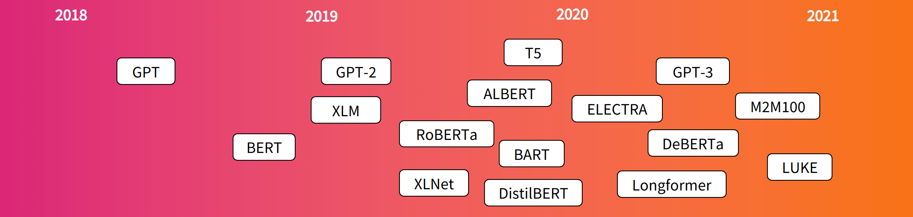

<style type="text/css">
  body{
  font-family: Arial;
  }
</style>

```{r load-packages, include=FALSE}
# Package names
packages <- c("RedditExtractoR", "tidytext", "tidyverse", "textdata", "anytime", "magrittr",
              "ggdark","gofastr", "termco", "syuzhet", "sentimentr", "lubridate", "here")

# Install packages not yet installed
installed_packages <- packages %in% rownames(installed.packages())
if (any(installed_packages == FALSE)) {
install.packages(packages[!installed_packages])
}

# Load packages
invisible(lapply(packages, library, character.only = TRUE))
```
  
# 1. Run sentiment analysis  
  
Sentiment analysis involves utilizing Natural Language Processing (NLP), along with other related techniques, to identify and quantify affective states, typically from text data. Similar to advancements we've observed in computer vision, recent developments have introduced well-packaged models that are user-friendly and can be readily implemented out of the box. In this chapter, we will explore a range of models, from rudimentary to more advanced ones, to practice their application in diverse scenarios.

## 1-1. Bag-of-Words model: `syuzhet` package  

The Bag-of-Words (BoW) model is one of the simplest techniques used in NLP and text mining to represent and analyze text data. In BoW, a text (such as a sentence or document) is represented as an unordered set or "bag" of its words, disregarding grammar, word order, and any structural elements in the text. 

```{r}
texts_1 <- c("R is a very powerful tool for data analysis.",
           "I hate bugs in the code. They are so annoying.",
           "I love programming in R! It’s so fun.")

# syuzhet package
get_sentiment(texts_1, method='nrc')
get_sentiment(texts_1, method='afinn')
get_sentiment(texts_1, method='syuzhet')
get_sentiment(texts_1, method='bing')

get_nrc_sentiment(texts_1)
```

Notice that, if the models think 'hate' is a negative word and 'love' is a positive word, then how about negations? Do models consider 'not love' positive or negative?  Let's see the next example.

```{r}
texts_2 <- c("I love programming in R! It’s so fun.",
             "I don't love programming in R! It’s not fun.")

# syuzhet package
get_sentiment(texts_2, method='nrc')
get_sentiment(texts_2, method='afinn')
get_sentiment(texts_2, method='syuzhet')
get_sentiment(texts_2, method='bing')
```

This example above demonstrates that sentiment analysis is challenging because it involves understanding not only individual words but also the context in which they are used. When you run basic sentiment analysis that only uses a bag-of-words model, it can't understand the context and treats every word independently. So, the words "love" and "fun" in both sentences are contributing to the positive score, and the model doesn't consider the "not" which changes the meaning of those words.
  
## 1-2. Negation handling model: `sentimentr` package  

Handling negation in NLP is crucial, as negation can entirely change the sentiment or meaning of a sentence. In sentiment analysis, the presence of a negation can reverse the polarity of a sentence.

```{r warning=F}
texts_2 <- c("I love programming in R! It’s so fun.",
             "I don't love programming in R! It’s not fun.")

# by sentence
sentiment(texts_2)

# by string (a group of sentences)
sentiment_by(texts_2)
```

```{r warning=F}
# attributes
sentiment_attributes(texts_2[1])$Attributes
sentiment_attributes(texts_2[2])$Attributes
```
  
## 1-3. State-of-the-art model

> In this section, we will employ a deep learning model; unfortunately, R is not the most conducive environment for training or testing such models. As expected, Python is the preferred option when it comes to deep learning due to its extensive libraries and community support. Similar to our approach in the computer vision module, we will utilize Google Colab ([link](https://colab.research.google.com/drive/1rynmZRcvB052PFaVQ2DsHrMYD1vyPN4Y?usp=sharing)). Upload (i.e., drag and drop) your Reddit data in csv format to your Colab session. You might as well use [this data](https://github.com/ujhwang/UrbanAnalytics2023/blob/main/Lab/module_5/sample_reddit.csv?raw=true).

In NLP, the state-of-the-art model architecture is undoubtedly **Transformer** (Check out the benchmark [here](https://paperswithcode.com/sota/sentiment-analysis-on-sst-2-binary)). The architecture was introduced in 2017 and has since become a foundation for many NLP models. The Transformer architecture has been highly influential in NLP due to its ability to handle long-range dependencies in text and its scalability, allowing the training of large models that capture intricate language patterns and semantics.

Timeline of popular Transformer model releases ([source](https://huggingface.co/blog/bert-101#1-what-is-bert-used-for)):


The script in Colab will demonstrate how to leverage a pre-trained **BERT** (Bidirectional Encoder Representations from Transformers) model to predict the sentiment of a given string. Developed by Google, BERT is a powerful language processing AI model designed for a range of NLP tasks.

BERT reads texts and pays attention to the surrounding words to understand the context of each word. This is the “bidirectional” part, as it learns about the word based on the words that come before and after it, unlike older models which typically read text in one direction (left to right).

Thus, BERT helps computers better understand the **meaning of words** ***in a sentence***. Imagine you’re learning a new language. When you hear or see a sentence, you don’t just look at each word in isolation—you look at the words around it to understand its meaning and context. If someone says, “It’s raining cats and dogs,” you understand that it’s an expression meaning it’s raining heavily, not that pets are falling from the sky.

Let's proceed to the [Colab](https://colab.research.google.com/drive/1rynmZRcvB052PFaVQ2DsHrMYD1vyPN4Y?usp=sharing) and analyze the sentiment of Reddit threads using the BERT model.

# 2. Output sanity check

Import the data processed from the Colab to R.
```{r}
reddit_sentiment <- read_csv(here('Lab', 'module_5', 'sample_reddit_bert.csv')) %>% 
  drop_na('bert_label')
```

Get sentiment scores using the method from 1-2 for comparison.
```{r}
reddit_sentiment %<>% 
  mutate(title = replace_na(title, ""),
         text = replace_na(text, ""),
         title_text = str_c(title, text, sep = ". "))

temp <- sentiment_by(reddit_sentiment$title_text)

reddit_sentiment$sentimentr <- temp %>% pull(ave_sentiment)
reddit_sentiment$word_count <- temp %>% pull(word_count)
```

Check the correlation between the sentiment values from two different methods. 0.28 implies a mild positive correlation.
```{r}
reddit_sentiment %<>% mutate(bert_label_numeric = str_sub(bert_label, 1, 1) %>% as.numeric())

cor(reddit_sentiment$bert_label_numeric, reddit_sentiment$sentimentr)
```
A scatter plot indicates that they are not very similar.
```{r}
ggplot(data = reddit_sentiment, aes(x = bert_label_numeric, y = sentimentr)) +
  geom_jitter(width = 0.1, height = 0) +
  geom_line(aes(y = 0), color = '#FFD700', lwd = 1, linetype='dashed') + 
  dark_theme_grey()
```
Two texts (with highest prediction scores) for each of the five categories.

```{r}
bert_example <- reddit_sentiment %>%
  group_by(bert_label) %>%
  arrange(desc(bert_score)) %>%
  slice_head(n = 2) %>%
  ungroup()

bert_example[, c('bert_label','title_text', 'subreddit')] %>% print()
```

Five texts with the highest polarity scores for each side.

```{r}
sentimentr_example <- reddit_sentiment %>%
  mutate(sentimentr_abs = abs(sentimentr),
         sentimentr_binary = case_when(sentimentr > 0 ~ 'positive',
                                       TRUE ~ 'negative')) %>% 
  group_by(sentimentr_binary) %>%
  arrange(desc(sentimentr_abs)) %>%
  slice_head(n = 5) %>%
  ungroup() %>% 
  arrange(sentimentr)

sentimentr_example[, c('sentimentr','title_text', 'subreddit')] %>% print()
```


# 3. Visualization

Let's visualize the sentiment analysis result from the BERT model.

## 3-1: 

word count
```{r}

```

wordclouds
```{r}

```

```{r}
reddit_sentiment_clean <- reddit_sentiment %>%
  group_by(bert_label) %>%
  filter(
    between(
      comments, 
      quantile(comments, 0.25) - 1.5 * IQR(comments), 
      quantile(comments, 0.75) + 1.5 * IQR(comments)
    )
  )

cor.test(reddit_sentiment_clean$comments, reddit_sentiment_clean$bert_label_numeric)

reddit_sentiment_clean %>% 
  ggplot(aes(x = bert_label_numeric, y = comments)) +
  geom_jitter(height = 0, width = 0.05) +
  geom_smooth(method = 'loess', span = 0.75) +
  dark_theme_gray()

```

## 3-2: Temporal analysis


```{r}
# create new columns: date, year, day_of_week, is_weekend, time
reddit_sentiment %<>% 
  mutate(date = as.POSIXct(date_utc)) %>%
  filter(!is.na(date)) %>% 
  mutate(year = year(date),
         day_of_week = wday(date, label = TRUE),
         is_weekend = ifelse(day_of_week %in% c("Sat", "Sun"), "Weekend", "Weekday"),
         time = timestamp %>% 
           anytime(tz = anytime:::getTZ()) %>% 
           str_split('-| |:') %>% 
           sapply(function(x) as.numeric(x[4])))
```

year

```{r}
# sentiment by year
reddit_sentiment %>% 
  ggplot(aes(x = date, y = bert_label_numeric)) +
  geom_jitter(width = 0, height = 0.05) +
  scale_x_datetime(date_labels = "%b %y",
                   breaks = seq(min(reddit_sentiment$date, na.rm = T), 
                                max(reddit_sentiment$date, na.rm = T), 
                                by = "1 year")) +
  dark_theme_grey()
```

```{r}
# sentiment by year
reddit_sentiment %>% 
  ggplot(aes(x = year, fill = bert_label)) +
  geom_bar(position = 'stack') +
  scale_x_continuous(breaks = seq(min(reddit_sentiment$year), 
                                  max(reddit_sentiment$year), 
                                  by = 1)) +
  scale_fill_brewer(palette = 'PuRd', direction = -1) + 
  dark_theme_grey()
```
day of week
```{r}
# sentiment by day
reddit_sentiment %>% 
  ggplot(aes(x = day_of_week, fill = bert_label)) +
  geom_bar(position = 'fill') +
  scale_fill_brewer(palette = 'PuRd', direction = -1) +
  dark_theme_grey()
```
time of day
```{r}
reddit_sentiment %>% 
  ggplot(aes(x = time, fill = bert_label)) +
  geom_histogram(bins = 24, position = 'stack', color = 'black', lwd = 0.2) +
  scale_x_continuous(breaks = seq(0, 24, by=1)) + 
  scale_fill_manual(values = c('#bc5090', '#bc5090', '#ff6361', '#ffa600', '#ffa600')) + 
  dark_theme_grey()
```


