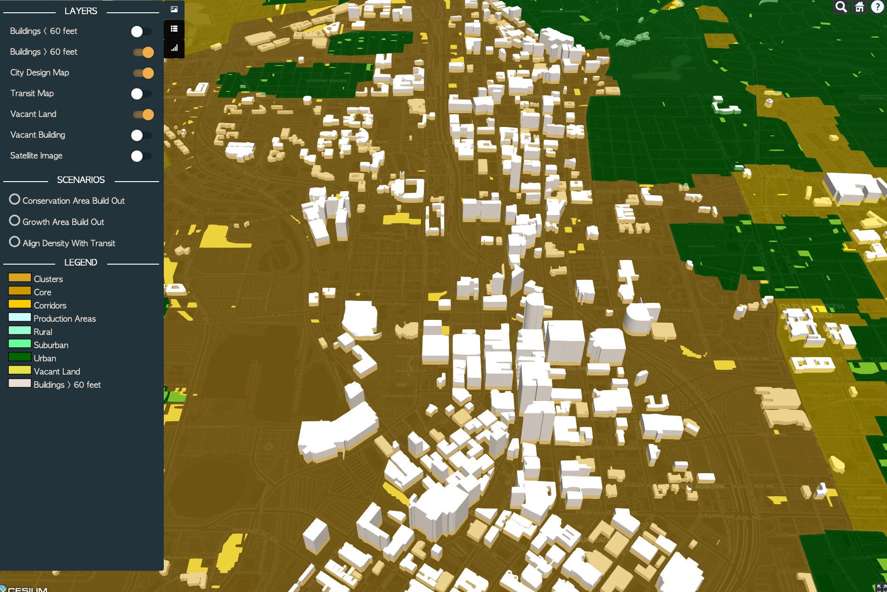
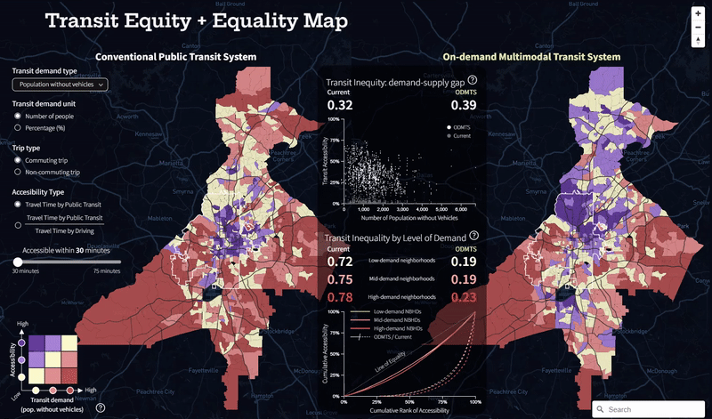
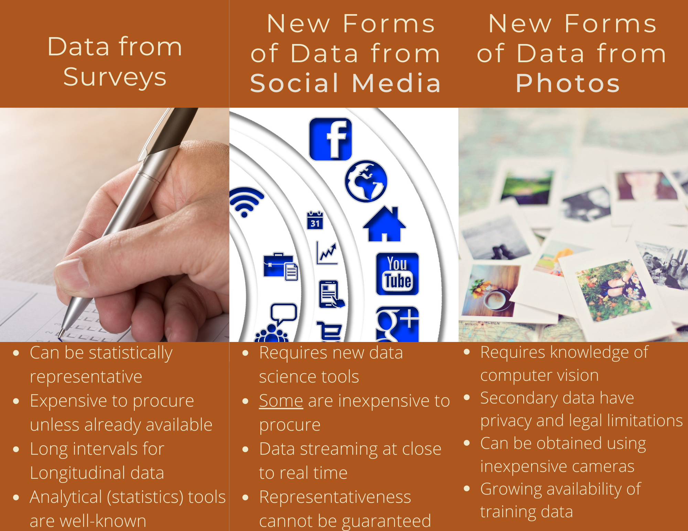

```{r setup, include = FALSE}
library(knitr)
library(tidyverse)
library(NHSRtheme)
# set default options
opts_chunk$set(echo = FALSE,
               fig.width = 10.252,
               fig.height = 10,
               dpi = 300)

# uncomment the following lines if you want to use the NHS-R theme colours by default
# scale_fill_continuous <- partial(scale_fill_nhs, discrete = FALSE)
# scale_fill_discrete <- partial(scale_fill_nhs, discrete = TRUE)
# scale_colour_continuous <- partial(scale_colour_nhs, discrete = FALSE)
# scale_colour_discrete <- partial(scale_colour_nhs, discrete = TRUE)
```

class: title-slide, left, bottom

# `r rmarkdown::metadata$title`
----
## **`r rmarkdown::metadata$subtitle`**
### `r rmarkdown::metadata$author`
### `r rmarkdown::metadata$date`

---
class: inverse, middle, center

## This is one of two required courses to complete 
###(other than the Capstone)
# the Master of Science in Urban Analytics degree

---

# What is Urban Analytics?

--

###Application of <b>Big data</b> and <b>data science tools</b> to understand, monitor, and control urban functions and processes

--

###Michael Goodchild defines it as a 'new kind of urban research, one that exploits the vast new sources that are becoming available from social media, crowd sourcing, and sensor networks...'

--

###'Urban analytics is fast emerging as the core set of tools employed to deal with problems of big data, urban simulation, and geodemographics' -- Michael Batty

--

##Analytics is the discovery, interpretation, and communication of meaningful patterns in data' --Wikipedia

---
# Introductions

.mid[
###Your Instructors for this class
]
.left-column[
```{r, include=F, out.height='100%'}
knitr::include_graphics("https://airmobility.gatech.edu/files/2019/06/Subhro-Guhathakurta-300x300.jpg")
```
# 
```{r, include=F, out.height='70%'}
knitr::include_graphics("https://ujhwang.github.io/images/IDphoto_Hwang.jpg")
```
# 
]
.right-column[
<b>Dr. Subhro Guhathakurta</b> joined Georgia Tech in 2011 as the director of the Center for Geographic Information Systems, which he re-branded in 2016 to be the Center for Spatial Planning Analytics and Visualization. He is the former chair of the School of City and Regional Planning, where he is also a professor. Dr. Guhathakurta is the Program Director of Master of Science in Urban Analytics.

<br>
<b>Uijeong Hwang</b> is a PhD candidate in City and Regional Planning at Georgia Institute of Technology and a graduate research assistant at the Center for Spatial Planning Analytics and Visualization (CSPAV). His research interests center around people's travel behavior and choices, particularly the factors that make people choose more walking, biking, and public transit.
]


---
#Class Introductions (continued..)
###We would like to know
* Your name
* Where you are from (hometown)
* Training (undergraduate degree, other degrees)
* Anticipated timeline to complete this program
---
class: inverse, middle, center

#Examples of Previous Urban Analytics projects at CSPAV
---
#Modeling Atlanta's Growth

<a href="https://geospatial.gatech.edu/AtlantaCityDesign/"></a>

---
#Transit Equity Dashboard
<a href="https://ujhwang.github.io/transit_equity"></a>

---
#UJ's MSUA Capstone: Covid-19 & eating habit
<a href="https://ujhwang.github.io/covid-19-eating-habit"></a>

---
<!-- #What is BIG data? -->
<!-- ##The Four Vs of Big Data -->
<!-- 1. Volume (or scale) -->
<!-- 2. Velocity (Streaming) -->
<!-- 3. Variety (Different forms: image, social media, census, etc.) -->
<!-- 4. Veracity (Uncertainty, confidence in its findings) -->

<!-- -- -->
<!-- ##For Spatial Data We should also include -->
<!-- 5. Granularity (spatial resolution) -->
<!-- --- -->
#Common Sources of Data

---
#Other Sources of Data
* Transactions
* Sensors (satellites, airborne, and terrestrial) 
* Administrative data (budgets, plans)
* Cell Phones (consumer data harvesting)
* Others?
___ 
*  
*  
---
class: inverse, left, top

#The Plan for the Course

##The course is divided into Six Modules
.left-column[
<font color="yellow">Module 1</font>
<br>
<br>
<br>
<br>
<br>
<font color="yellow">Module 2</font>
<br>
<br>
<br>
<br>
<font color="yellow">Module 3</font>

]


* Using APIs to capture data
* Combining data from two sources to conduct analysis
* Data wrangling and tidying
<br>
<br>
* Interactive visualization
* Telling stories with data / analysis
<br>
<br>
* Using General Transit Feed Specification (API)
* Network analysis with Open Street Maps
---
class: inverse, left, top
<br>
<br>
.left-column[
<font color="yellow">Module 4</font>
<br>
<br>
<br>
<br>
<font color="yellow">Module 5</font>
<br>
<br>
<br>
<br>
<br>
<font color="yellow">Module 6</font>
]

* Using Computer Vision to extract information from images 
* Extracting information from Google Street View images
<br>
<br>
* Unstructured data -- accessing Reddit data
* Natural language processing
* Sentiment analysis
<br>
<br>
* Data ethics
* Data privacy
___
---
#Course Logistics

###Platform
* R-Studio (almost entirely)
* Available as a "Container" in a Docker environment
* All packages will be preinstalled (less worry about software / hardware glitches)

###Communication (very impotant)
* Canvas
* Discussion Board on Canvas
* emails (mostly through CANVAS)

### Readings
* Mostly Online!
* Posted on CANVAS if not Online

---

###Assignments
* Submission in RMarkdown documents (to RPubs or GitHub)
* Post the link to this document ONLY
* The best 3 scores of 4 minor and best 3 of 4 major assignments considered for final grades

###Class presentations 
* Three student presentations (by groups) for final project milestones
* A survey will be administered to form the groups

### Final Group Assignment
* More details forthcoming

##Any other questions?


